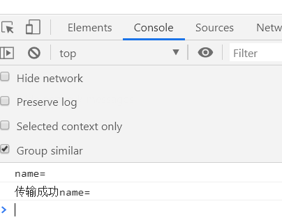
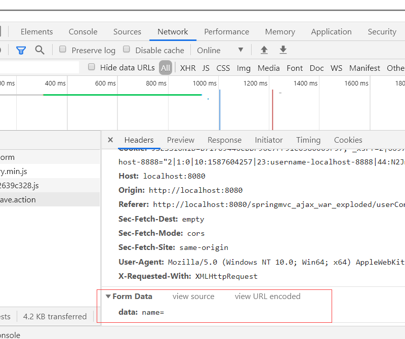
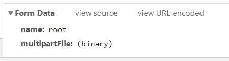

## 1. ajax以表单数据提交

前端通过jquery ，后端使用了springmvc作为测试

**前端**

```java
<form id="form" modelAttribute="user" enctype="multipart/form-data" method="post"
      action="userController/saveUser.action">
    <fieldset>
        <legend>Add a User</legend>
        <p>
            <label>用户名:</label>
            <input type="text" name="name"/>
            <span id="name" class="error"></span>
        </p>
        <p>
            <label>文件上传:</label>
            <input type="file" name="multipartFile" multiple="multiple">
        </p>
        <p id="buttons">
            <input id="reset" type="reset">
             <input id="submits" value="测试提交" type="button">
        </p>
    </fieldset>
</form>
```

```java
$("#submits").click(function () {
    //将表单序列化
    var formData = $("#form").serialize();
    console.log(formData);
    $.ajax({
        url: "userController/testSave.action",
        type: "post",
        data: formData,
        contentType: "application/x-www-form-urlencoded",//默认
        success: function (data) {
            console.log("传输成功" + data);
        },
        error: function () {
            console.log("传输失败");
        }
    })
});
```

**后端**：

```java
@RequestMapping(value = "testSave.action", method = {RequestMethod.POST})
public void testSave(User user, Model model, HttpServletResponse response, HttpServletRequest req) throws IOException {
    String data = req.getParameter("data");
    response.getWriter().write(data);
}
```


结果如下：





如上，通过`$('#form').serialize()`可以对 form 表单进行序列化，从而将 form 表单中的所有参数传递到服务端。

但是上述方式，只能传递一般的参数，上传文件的文件流是无法被序列化并传递的。不过如今主流浏览器都开始支持一个叫做 `FormData` 的对象，有了这个对象就可以轻松地使用 Ajax 方式进行文件上传了。

**使用 FormData 进行 Ajax 请求并上传文件**

```javascript
$("#submits").click(function () {
    //var formData = $("#form").serialize();
    var formData = new FormData(document.getElementById("form"));
    console.log(formData);
    $.ajax({
        url: "userController/testSave.action",
        type: "post",
        data: formData,
        contentType: false,
        processData: false,
        success: function (data) {
            console.log("传输成功" + data);
        },
        error: function () {
            console.log("传输失败");
        }
    })
});
```

FormData`对象必须接收的javaScript对象，所以`$("#uploadForm")`jquery对象必须转成javascript对象，+[0]。


**后端controller层**

```Java
@RequestMapping(value = "testSave.action", method = {RequestMethod.POST})
@ResponseBody //支持服务器向浏览器发送各种数据,java对象以json格式返回
public String testSave(User user, Model model, HttpServletResponse response,
                       HttpServletRequest req) throws IOException {
    MultipartFile[] multipartFile = user.getMultipartFile();
    System.out.println(multipartFile[0].getOriginalFilename());
    return user.getName();
}
```


结果：



可见文件已经上传进来。

## 2. ajax以json数据提交

前端：

```javascript
 $("#submits").click(function () {
    $.ajax({
        url: "userController/testSave.action",
        type: "post",
        data:JSON.stringify({'name': 'root'}),
        contentType: "application/json",
        success: function (data) {
            console.log("传输成功" + data);
        },
        error: function () {
            console.log("传输失败");
        }
    })
});
```

**后端controller层**:

```java
@RequestMapping(value = "testSave.action", method = {RequestMethod.POST})
@ResponseBody //支持服务器向浏览器发送各种数据,java对象以json格式返回
public String testSave(@RequestBody User user, Model model, HttpServletResponse response,HttpServletRequest req) throws IOException {
    return user.getName();
}
```

注意一点`@ResponseBody`并不能将String类型返回值以json格式响应。

