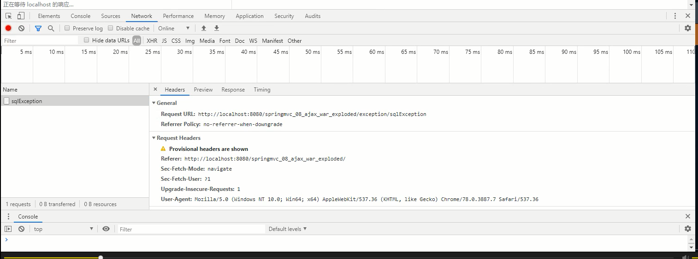
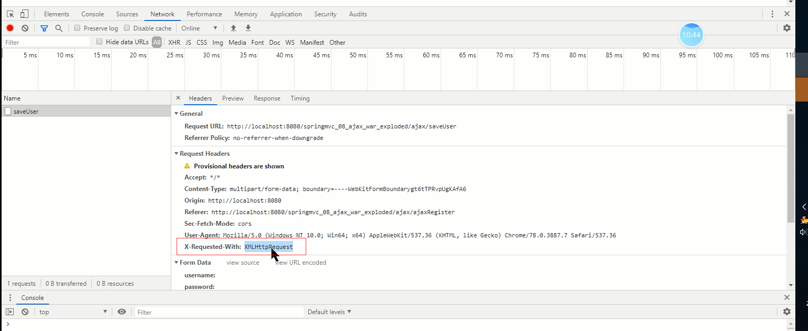

## spring统一异常处理

此处介绍异常处理的三种方式

* `SimpleMappingExceptionResolver`类，
* 实现`HandlerExceptionRsolver`接口
* `@ExceptionHandle`注解异常


* 自定义全局异常，继承`SimpleMappingExceptionResolver`

先说总结：

* 实现`HandlerExceptionRsolver接口`既需要配置也需要写代码

* @ExceptionHandle注解异常，需要所有的`Contoller`类统一继承一个`BaseController`类，对于java单继承来说是非常不友好的。这里的`BaseController`是我们自定义的，你也可以叫其他名字。

* `SimpleMappingExceptionResolver类`只需要在配置文件进行配置

前面三种方式都存在同一个缺陷，只能实现表单提交的异常处理，无法在ajax异步提交进行异常处理，因为是通过将错误页面通过存入`request`作用域进行请求转发实现的，。

## 1. SimpleMappingExceptionResolver类

使用org. springframework.web.servlet. handler.SimpIeMappingExceptionResolver类统一处理异常时，需要在配置文件中提前配置异常类和View的对应关系。配置文件springmvc- servlet. xml的具体代码如下:

1.配置文件springmvc.xml

```xml
 <!--配置SimpleMappingExceptionResolver，（异常类与view的对应关系）-->
<bean class="org.springframework.web.servlet.handler.SimpleMappingExceptionResolver">
    <!--定义默认的异常处理页面-->
    <property name="defaultErrorView" value="error"></property>
    <!--定义异常处理页面获取异常的变量名，默认为exception-->
    <property name="exceptionAttribute" value="ex"></property>
    <!--定义特殊处理异常，用类名或者完全路径作为key,异常页名作为值-->
    <property name="exceptionMappings">
        <props>
            <prop key="java.sql.SQLException">页面位置</prop>
        </props>
    </property>
</bean>
```

* 从配置文件可以看出，`exceptionMappings`负责配置特殊异常类对象，`key`为抛出的异常对象

* 如果出现的异常没有特殊异常类匹配，那么将会跳转`defaultErrorView`默认异常处理页面，`value`既可以是页面路径也可以是一个单独的字符串。

* `SimpleMappingExceptionResolver`会通过请求转发的方式将异常对象存入request作用域，默认的对象名为`exception`如果想要改变对象名，可以在`exceptionAttribute`属性中更改

异常配置通常又有不同的几种情况

* 已经存在的异常类
* 自定义异常类
* 默认异常

### 实现

1.在后端抛出异常对象，例如

```java
throw new IndexOutOfBoundsException("");
```

2.`SimpleMappingExceptionResolver`会获取异常对象，转发新页面。

3.在前端后去异常信息，异常对象存储在请求作用域


额外说下404异常

在web.xml中配置

```xml
<error-page>
    <location>/WEB-INF/jsp/xxx.jsp</location>
</error-page>
```


## 2. 实现HandlerExceptionRsolver接口

> 你会发现` SimpleMappingExceptionResolver`其实就是`HandIerExceptionResolver`的一个实现类

org. springframework. web. servlet. HandlerExceptionResolver接口用于解析请求处理过程中所产生的异常。开发者可以开发该接口的实现类进行SpringMVC应用的异常统处理。

1.创建一个HandIerExceptionResolver接口的实现类MyExceptionHandler

```java
 @Override
public ModelAndView resolveException(HttpServletRequest request, HttpServletResponse response,Object handler, Exception arg3) {
    Map<String, Object> model = new HashMap<String, Object>();
    model.put("ex", arg3);
    //根据不同错误转向不同页面(统一处理) ，即异常与view的对应关系
    if (arg3 instanceof MyException) {
        return new ModelAndView("forward:/WEB-INF/jsp/error/error.jsp", model);
    } else if (arg3 instanceof SQLException) {
        return new ModelAndView("", model);
    } else {
        return new ModelAndView("", model);
    }
}
```

2.在配置文件springmvc.xml中进行注册

```java
 <bean class="com.jsu.js.Exception.MyExceptionHandler"/>
```

3.在后端抛出异常对象

4.`MyExceptionHandler`会接收抛出异常对象，转发新页面。

5.在前端后去异常信息，异常对象存储在请求作用域

## 3. @ExceptionHandle注解异常

> 相较于`HandlerExceptionRsolver接口`配置异常，注解异常不需要在配置文件spring.xml中声明异常类

1.创建BaseController

```java
@Controller
public abstract class BaseController {
    @ExceptionHandler
    public String  exception(HttpServletRequest request,Exception ex){
        request.setAttribute("ex",ex);
        //根据不同错误转向不同页面(统一处理) ，即异常与view的对应关系
        if (ex instanceof MyException) {
            return "forward:/WEB-INF/jsp/error/error.jsp" ;
        } else if (ex instanceof SQLException) {
            return "页面" ;
        } else {
            return "页面" ;
        }
    }
}
```

2.继承BaseController


普通表单提交



ajax请求的标志

在请求头中有x-Requested-With对象



